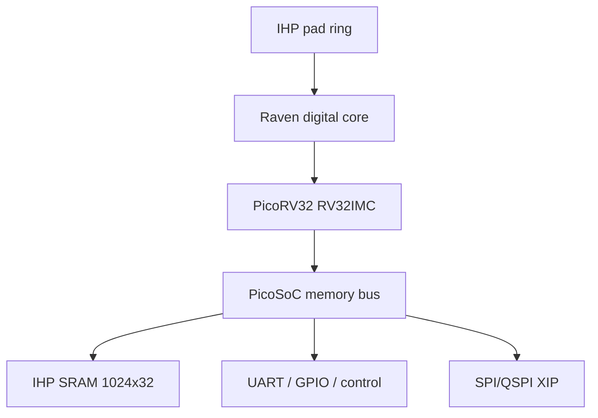

# Raven PicoRV32 Full-Chip Implementation
## LibreLane + IHP Open PDK `ihp-sg13g2`

This guide is a complete reference package for implementing the digital portion of
**Raven/PicoSoC/PicoRV32** as a full chip from RTL to GDSII using LibreLane and the
IHP SG13G2 PDK. The repository includes RTL, an I/O pad ring, an SRAM macro,
power-delivery configuration, timing constraints, firmware, a testbench, and
scripts for collecting implementation evidence.

> Package status: **digital full-chip implementation baseline** for education,
> PPA exploration, and subsequent mixed-signal integration. It is not a drop-in
> replacement for the original Raven GDS manufactured in X-Fab XH018.

## 1. Scope and porting principles

The original Raven contains PicoRV32, a 1024×32 SRAM, UART, 16 GPIOs, SPI flash,
configuration SPI, and analog circuits including an ADC, DAC, comparator,
PLL/oscillator, bandgap, and temperature alarm. These analog blocks are
process-specific X-Fab IP and their netlists and layouts cannot be reused directly
in IHP SG13G2.

This package retains the synthesizable logic and Raven memory map:

- RV32IMC PicoRV32 with interrupt support
- Execute-in-place from external SPI/QSPI flash at `0x0010_0000`
- 4 KiB IHP SRAM macro `RM_IHPSG13_1P_1024x32_c2_bm_bist`
- UART at `0x0200_0004` and `0x0200_0008`
- 16-bit GPIO and configuration registers at `0x0300_0000`
- Standalone configuration SPI and Raven identification registers
- Eight analog-pad placeholders and a register-level analog-control interface

Analog status and data inputs are tied to safe constants in this baseline. Before
tapeout, replace them with IHP analog IP or verified custom macros and repeat LVS,
PEX, and mixed-signal verification.

## 2. References and versions

- Raven repository used for this project: <https://github.com/chumnarn/raven-picorv32>
- Original Raven upstream: <https://github.com/efabless/raven-picorv32>
- PicoRV32 upstream: <https://github.com/YosysHQ/picorv32>
- IHP LibreLane template: <https://github.com/IHP-GmbH/ihp-sg13g2-librelane-template>
- IHP Open PDK: <https://github.com/IHP-GmbH/IHP-Open-PDK>
- LibreLane documentation: <https://librelane.readthedocs.io/>

Files under `rtl/upstream/` originate from Raven commit
`7d38cc0f1366f6b2c157a73c556e95e794bf093c`. Only one functional change was
made to `raven_soc.v`: `ram_wstrb[3:0]` was added so that the IHP SRAM byte-write
mask is handled correctly.

## 3. Architecture



The main clock enters through `clk_PAD`; reset is active-low at `rst_n_PAD`.
The primary target is 100 MHz (`CLOCK_PERIOD=10 ns`), with a 50 MHz target for
initial bring-up.

## 4. Directory structure

```text
raven-ihp-sg13g2-fullchip/
├── Makefile
├── README.md
├── flake.nix, flake.lock, shell.nix
├── rtl/
│   ├── chip_top.sv                 # IHP pads and full-chip top
│   ├── raven_chip_core.sv          # Raven digital integration
│   ├── wrappers/raven_sram_1kx32.sv
│   └── upstream/                   # Raven/PicoRV32 sources
├── firmware/
│   ├── main.c, start.S, sections.lds
│   ├── raven_defs.h
│   └── reference_raven_demo.hex    # Prebuilt simulation image
├── sim/
│   ├── tb_raven_chip_core.sv
│   ├── spiflash.v
│   └── Makefile
├── librelane/
│   ├── config.yaml
│   ├── chip_top.sdc
│   └── pdn_cfg.tcl
├── ip/bondpad_70x70_novias/
├── scripts/
│   ├── check_project.sh
│   ├── summarize_ppa.py
│   └── collect_evidence.sh
└── docs/
```

## 5. Pin map

### 5.1 Dedicated pads

| Top-level port | Direction | Function |
|---|---:|---|
| `clk_PAD` | input | 100 MHz core clock |
| `rst_n_PAD` | input | Asynchronous external reset, active low |
| `VDD`, `VSS` | power | 1.2 V core supply and ground |
| `IOVDD`, `IOVSS` | power | I/O supply and ground per PDK pad specification |

### 5.2 `input_PAD[4:0]`

| Index | Signal | Notes |
|---:|---|---|
| 0 | UART_RX | Idle high |
| 1 | IRQ | Dedicated PicoRV32 interrupt |
| 2 | CFG_SCK | Standalone SPI clock; asynchronous to the core clock |
| 3 | CFG_SDI | Standalone SPI data input |
| 4 | CFG_CSB | Standalone SPI chip select, active low |

### 5.3 `output_PAD[4:0]`

| Index | Signal | Notes |
|---:|---|---|
| 0 | UART_TX | `simpleuart` output |
| 1 | TRAP | PicoRV32 trap indication |
| 2 | FLASH_CSB | External boot-flash select |
| 3 | FLASH_CLK | External boot-flash clock |
| 4 | CFG_SDO | Standalone SPI readback; tri-stated while CSB is inactive |

### 5.4 `bidir_PAD[19:0]`

| Range | Signal | Direction control |
|---|---|---|
| `[15:0]` | GPIO[15:0] | Raven `gpio_oeb`, converted to IHP active-high OE |
| `[16]` | FLASH_IO0 | SPI/QSPI controller OE |
| `[17]` | FLASH_IO1 | SPI/QSPI controller OE |
| `[18]` | FLASH_IO2 | SPI/QSPI controller OE |
| `[19]` | FLASH_IO3 | SPI/QSPI controller OE |

`analog_PAD[7:0]` is reserved for analog-macro integration. Do not claim analog
signoff until schematics and layouts are connected and real LVS/PEX has passed.

## 6. Memory map

| Address | Register or region | Function |
|---|---|---|
| `0x0000_0000–0x0000_0FFF` | SRAM | 4 KiB scratchpad |
| `0x0010_0000…` | SPI flash XIP | Reset and program address |
| `0x0200_0000` | SPI control | Memory-mapped SPI configuration |
| `0x0200_0004` | UART divider | Baud-rate divider |
| `0x0200_0008` | UART data | TX/RX data |
| `0x0300_0000` | GPIO data | `{gpio_out,gpio_in}` |
| `0x0300_0004` | GPIO output enable | Active-low Raven semantics |
| `0x0300_0008` | GPIO pull-up | Control register |
| `0x0300_000C` | GPIO pull-down | Control register |
| `0x0300_0010–0x0300_00E8` | Mixed-signal controls | Register interface retained; data/status stubbed |

Register names are defined in `firmware/raven_defs.h`.

## 7. Tools and prerequisites

Recommended environment: Ubuntu 22.04/24.04 or WSL2, Nix, LibreLane 3.x,
Ciel, and the `ihp-sg13g2` PDK. Standard-cell, I/O-pad, and SRAM-macro views
must all be installed.

Additional tools:

- Icarus Verilog for RTL simulation
- RISC-V GCC with `rv32imc/ilp32` support for firmware compilation
- GTKWave for waveform inspection
- KLayout and the OpenROAD GUI supplied by the LibreLane environment

## 8. Quick start

```bash
mkdir -p ~/labs
cd ~labs
git clone https://github.com/chumnarn/raven-picorv32.git
cd ~/labs/raven-picorv32

cd raven-ihp-sg13g2-fullchip
nix-shell
make setup
make check
make sim
make flow-50mhz
make flow
make ppa
make evidence
```

If the PDK is installed outside the project:

```bash
export PDK_ROOT=$HOME/eda/IHP-Open-PDK
make check
make flow
```

## 9. Step-by-step full-chip flow

### Step 0 — Verify the environment

```bash
nix-shell
librelane --version
ciel --version
openroad -version
klayout -v
```

The LibreLane configuration uses YAML schema `meta.version: 3` and
`flow: Chip`. Do not convert it back to the legacy OpenLane Tcl format.

### Step 1 — Install or activate the PDK

```bash
make setup
```

The Makefile pins the same PDK revision as the IHP full-chip template so that
LEF/GDS names, Liberty corners, and SRAM views match `config.yaml`. Verify with:

```bash
ls "$PDK_ROOT/ihp-sg13g2/libs.ref/sg13g2_sram"/{lef,gds,lib,verilog}
make check
```

A successful check ends with:

```text
PASS: project sources and required IHP SRAM views are present
```

### Step 2 — Verify RTL and hierarchy

The flow must preserve the following top-level hierarchy:

```text
chip_top
└── u_core : raven_chip_core
    ├── u_soc : raven_soc
    │   └── cpu : picorv32
    ├── u_cfg_spi : raven_spi
    └── u_sram : raven_sram_1kx32
        └── u_sram : RM_IHPSG13_1P_1024x32_c2_bm_bist
```

The macro instance in `config.yaml`, `PDN_MACRO_CONNECTIONS`, and
`pdn_cfg.tcl` must match exactly: `u_core.u_sram.u_sram`.

### Step 3 — Run RTL simulation

```bash
make sim
gtkwave sim/raven_core.vcd
```

The testbench uses the behavioral SRAM wrapper, the upstream Raven SPI-flash
model, and `reference_raven_demo.hex`; therefore, a smoke test can run without
recompiling the firmware. Important signals are:

- `output_out[2]`: flash chip select
- `output_out[3]`: flash clock
- `bidir_bus[19:16]`: QSPI data
- `bidir_bus[15:0]`: GPIO
- `output_out[0]`: UART TX
- `output_out[1]`: trap

### Step 4 — Build the example firmware

Set the toolchain prefix for the installed compiler:

```bash
make firmware RISCV_PREFIX=/opt/riscv32i/bin/riscv32-unknown-elf-
```

Or, when the toolchain is already in `PATH`:

```bash
make firmware RISCV_PREFIX=riscv32-unknown-elf-
```

The firmware is linked at `0x0010_0000` to match `PROGADDR_RESET` in
`raven_soc.v`. The `objcopy -O verilog` command creates an image for the SPI
flash model.

### Step 5 — Elaborate and synthesize

Run through synthesis first to identify unresolved modules:

```bash
librelane --pdk ihp-sg13g2 \
  --pdk-root "$PDK_ROOT" --manual-pdk \
  --run-tag synth01 --to Yosys.Synthesis \
  librelane/config.yaml
```

Confirm that the log contains PicoRV32, the register file, UART, SPI, and one
SRAM macro. The following conditions are not acceptable:

- `module not found`
- An unmapped `$mem` for the main scratchpad
- Missing macro `u_core.u_sram.u_sram`
- A new combinational loop or inferred latch caused by the wrapper

### Step 6 — Create the floorplan and pad ring

```bash
librelane --pdk ihp-sg13g2 \
  --pdk-root "$PDK_ROOT" --manual-pdk \
  --run-tag fp01 --to OpenROAD.Floorplan \
  librelane/config.yaml
```

The baseline uses a `3200 × 3200 µm` die and a `2340 × 2340 µm` core. Its 48
pads are distributed over four sides so that GPIO and QSPI pads remain close to
their routing groups. The approximately `416.64 × 336.46 µm` SRAM is placed near
the center of the core at `(1390,1400)`.

Inspect the result in OpenROAD:

```bash
make gui
```

Acceptance criteria:

- Every pad lies on the die boundary with no overlap
- Each bond pad aligns with its I/O pad
- The SRAM lies within the core and does not intersect the ring or halo
- The instance name matches the macro-placement constraint

### Step 7 — Plan power distribution

The design has a `VDD/VSS` core domain and an `IOVDD/IOVSS` I/O domain. Pad
power pins are connected explicitly. `pdn_cfg.tcl` builds the standard-cell and
SRAM power grids.

The SRAM power groups `VDD!`, `VSS!`, `VDDARRAY!`, and `VSS!` are mapped to
top-level `VDD/VSS` through `PDN_MACRO_CONNECTIONS`.

Inspect the post-PDN log:

```bash
rg -n "PDN-0110|PSM-0025|No via inserted|Grid check" librelane/runs/<RUN_TAG>
```

Treat `PSM-0025` or a disconnected power grid as a failure. Investigate the
coordinates and count for each `PDN-0110`; repeated warnings on macro supply
pins must not be ignored.

### Step 8 — Place standard cells

Begin bring-up at 50 MHz:

```bash
make flow-50mhz RUN_TAG=raven_bringup
```

If congestion is high:

1. Reduce `PL_TARGET_DENSITY_PCT` from 38 to 32–35.
2. Increase the core area while preserving pad clearance.
3. Inspect high-fanout reset and OE nets.
4. Do not move the SRAM without updating both `config.yaml` and its PDN grid.

### Step 9 — Build the clock tree

The clock is created on the internal pad pin `clk_pad/p2c`, not directly on the
package port, so insertion delay after the input pad is included consistently.

Check:

- Skew and insertion delay
- Post-CTS setup and hold WNS
- Clock transition and capacitance
- Buffer fanout and congestion around the SRAM

Standalone configuration SPI uses `input_PAD[2]` as another clock domain. Its
CDC timing relationship to the core clock is cut in the SDC. For hardware use,
add `set_max_delay` constraints or SPI timing constraints derived from the board
specification.

### Step 10 — Perform global and detailed routing

The target is zero unrouted nets and zero antenna violations after repair:

```bash
rg -n "unrouted|GRT-|DRT-|antenna|violation" librelane/runs/<RUN_TAG>
```

For `GRT-0042 invalid routing layer`, verify that IHP layer names are used:
`Metal1...Metal5`, `TopMetal1`, and `TopMetal2`. Do not use SKY130-style `met5`.

### Step 11 — Close signoff timing

Primary targets:

| Check | Acceptance |
|---|---:|
| Setup WNS | `>= 0 ns` at every signoff corner |
| Setup TNS | `0 ns` |
| Hold WNS/TNS | `>= 0 ns` / `0 ns` |
| Unconstrained paths | 0, except explicitly declared analog placeholders |
| Maximum transition/capacitance/fanout | 0 violations |

Run the 100 MHz target:

```bash
make flow RUN_TAG=raven_100m
make ppa
```

If 100 MHz does not close, retain 50 MHz as the functional baseline. Continue
with sizing, buffering, density and floorplan exploration, and critical-path
review. Do not silently lower the clock target.

### Step 12 — Run physical verification

A full signoff run must enable KLayout and Magic DRC, antenna checking, LVS, and
density checks as performed by `make flow`. Skipping DRC is permitted only for
iteration:

```bash
make flow-nodrc RUN_TAG=raven_route_debug
```

Never use a `flow-nodrc` result as tapeout evidence. Label it explicitly as
`DRC/antenna/density skipped`.

Digital physical-verification criteria:

- KLayout DRC = 0
- Magic DRC = 0, or fully reviewed and recorded waivers
- Clean LVS
- Clean antenna check
- Clean density check
- Illegal overlaps = 0
- Clean power connectivity

### Step 13 — Inspect the layout visually

```bash
make gui
make klayout
```

Inspect the die boundary, pad orientation, bond pads, seal ring, SRAM
obstructions, power-ring continuity, routing congestion, fill density, and pin
accessibility.

### Step 14 — Generate the PPA summary and evidence package

```bash
make ppa
make evidence
```

`scripts/summarize_ppa.py` selects the latest run and reads the available
metrics. `collect_evidence.sh` collects GDS, LEF, DEF, netlist, SDF, metrics,
and a manifest under `evidence/<RUN_TAG>/`.

## 10. Common LibreLane commands

Run through one selected step:

```bash
librelane --pdk ihp-sg13g2 --pdk-root "$PDK_ROOT" --manual-pdk \
  --run-tag fp_debug --to OpenROAD.Floorplan librelane/config.yaml
```

Override the clock without editing the configuration:

```bash
librelane --pdk ihp-sg13g2 --pdk-root "$PDK_ROOT" --manual-pdk \
  --override-config CLOCK_PERIOD=15 --run-tag p66m librelane/config.yaml
```

Open the latest run:

```bash
make gui
make klayout
```

## 11. Configuration checkpoints

Before each run, verify the following values are consistent:

| Item | Required value |
|---|---|
| `DESIGN_NAME` | `chip_top` |
| Flow | `Chip` |
| PDK | `ihp-sg13g2` |
| Main clock | `clk_PAD` / `clk_pad/p2c` |
| Target period | 10 ns baseline |
| SRAM macro | `RM_IHPSG13_1P_1024x32_c2_bm_bist` |
| SRAM instance | `u_core.u_sram.u_sram` |
| Power nets | `VDD/VSS`; pad cells also use `IOVDD/IOVSS` |
| Die/core | 3200² / 2340² µm |

## 12. Troubleshooting

### 12.1 `CheckMacroInstances` cannot find the SRAM

The hierarchy was probably flattened, or the instance path in the configuration
does not match the RTL.

```bash
rg -n "u_core|u_sram" rtl librelane/config.yaml librelane/pdn_cfg.tcl
```

Every reference must use `u_core.u_sram.u_sram`, and `USE_IHP_SRAM` must be
present in `VERILOG_DEFINES`.

### 12.2 `add_global_connections ... Made 0 connections`

Verify that every pad instance connects `.iovdd(IOVDD)`, `.iovss(IOVSS)`,
`.vdd(VDD)`, and `.vss(VSS)`, and that top-level power ports were not removed by
conditional compilation. This package declares power ports unconditionally.

### 12.3 The PDK does not contain the SRAM Liberty corner

```bash
find "$PDK_ROOT/ihp-sg13g2/libs.ref/sg13g2_sram/lib" \
  -name 'RM_IHPSG13_1P_1024x32*'
```

The fast macro filename uses `m55C`, but maps to the PDK fast-timing corner key
as defined by the IHP template. If another PDK revision is used, compare and
update all corner names.

### 12.4 The SDC cannot find `clk_pad/p2c`

Inspect the synthesized hierarchy and the `sg13g2_IOPadIn` pin name. If the tool
changes hierarchy separators, open the synthesis netlist or ODB and update both
`CLOCK_NET` and the SDC together.

### 12.5 Routing congestion

- Reduce density to 32–35%.
- Increase the core area.
- Move the SRAM away from the hotspot and update the PDN concurrently.
- Review QSPI/GPIO pad grouping.
- Analyze the congestion heat map before adding routing layers.

### 12.6 Timing does not close at 100 MHz

Classify critical paths as register-to-register, SRAM-to-register,
register-to-SRAM, or I/O. Adjust the floorplan, density, buffering, and drive
strength according to the actual cause. Never mark a functional path false only
to make timing reports pass.

### 12.7 LVS fails around the SRAM

Verify `PDN_MACRO_CONNECTIONS`, the macro GDS/LEF/netlist revisions, and power
pin names. All views must come from the same PDK revision.

## 13. Analog-integration roadmap

An IHP implementation equivalent to the mixed-signal Raven requires:

1. Select or design the ADC, DAC, comparator, oscillator/PLL, POR, bandgap, and sensor.
2. Define analog supply domains, the ESD strategy, and guard rings.
3. Create LEF abstracts, GDS, CDL/SPICE, and Liberty or black-box timing views as appropriate.
4. Replace constant ties in `raven_chip_core.sv` with macro interfaces.
5. Place analog macros away from CPU, clock, and QSPI noise sources.
6. Run mixed-signal simulation, LVS, PEX, IR/EM, and substrate-noise review.
7. Redefine pad, bonding, package, and board constraints.

The existing analog pads are reserved locations only; they do not constitute a
performance guarantee.

## 14. Tapeout-readiness checklist

- [ ] RTL regression and firmware boot pass
- [ ] Lint, CDC, and RDC reviews pass
- [ ] Synthesis contains no unresolved or unmapped functional cells
- [ ] SRAM macro views and hierarchy agree
- [ ] Pad ring, bond pads, and seal ring pass visual review
- [ ] Power connectivity and IR/EM pass
- [ ] Setup, hold, and MMMC checks pass at every corner
- [ ] Maximum slew, capacitance, and fanout checks pass
- [ ] Detailed routing contains no open, short, or unrouted nets
- [ ] DRC, LVS, antenna, density, and XOR pass, or have approved waivers
- [ ] Gate-level simulation and SDF checks pass according to signoff policy
- [ ] GDS, netlist, LEF, SDF, SDC, metrics, and checksums are stored in the evidence package
- [ ] Analog macros pass separate schematic, layout, and mixed-signal signoff
- [ ] Package, ESD, latch-up, pin-current, and board interfaces are reviewed

## 15. Meaning of “ready to run”

The package contains all project sources and automation, but generating GDS
requires LibreLane and the PDK to be installed on the user's machine. After
entering `nix-shell`, the minimum command sequence is:

```bash
make setup check
make flow-50mhz RUN_TAG=raven_bringup
make flow RUN_TAG=raven_100m
make ppa evidence
```

A successful flow on one PDK/tool revision does not guarantee identical results
on another revision. Record the LibreLane, OpenROAD, KLayout, Ciel, and PDK
commits and the run configuration with every signoff result.

## 16. License and attribution

Raven/PicoRV32-derived files retain their original copyright notices and are
subject to `LICENSE.upstream-raven`. New integration files in this package are
identified as Apache-2.0. Review the licenses of bond-pad and template-derived
assets in the IHP template and PDK before redistribution or production use.
