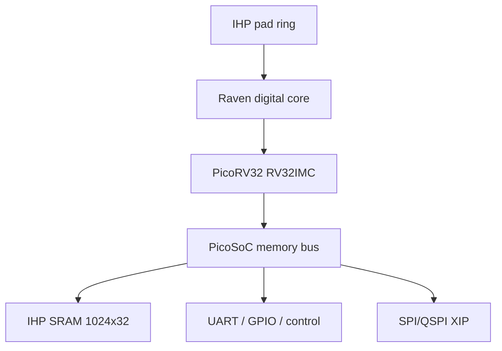

# Raven PicoRV32 Full-Chip Implementation
## LibreLane + IHP Open PDK `ihp-sg13g2`

คู่มือนี้เป็นแพ็กเกจอ้างอิงสำหรับนำระบบดิจิทัลของ **Raven/PicoSoC/PicoRV32**
มาทำ full-chip RTL-to-GDSII ด้วย LibreLane และ IHP SG13G2 PDK โดยเตรียม RTL,
I/O pad ring, SRAM macro, PDN, constraints, firmware, testbench และสคริปต์รวบรวม
หลักฐานครบใน repository เดียว

> สถานะของแพ็กเกจ: **digital full-chip implementation baseline** สำหรับการศึกษา,
> การทำ PPA exploration และการต่อยอด mixed-signal integration ไม่ใช่ drop-in
> replacement สำหรับ GDS เดิมของ Raven ที่ผลิตด้วย X-Fab XH018

## 1. ขอบเขตและหลักการ port

Raven ต้นฉบับมี PicoRV32, SRAM 1024×32, UART, GPIO 16 ช่อง, SPI flash,
configuration SPI และวงจรอนาล็อก ได้แก่ ADC, DAC, comparator, PLL/oscillator,
bandgap และ temperature alarm วงจรอนาล็อกเหล่านั้นเป็น process-specific IP ของ
X-Fab จึงไม่สามารถนำ netlist/layout มาใช้กับ IHP SG13G2 ได้โดยตรง

แพ็กเกจนี้คงส่วนที่สังเคราะห์ได้และ memory map ของ Raven ไว้ดังนี้

- PicoRV32 แบบ RV32IMC พร้อม interrupt
- execute-in-place จาก external SPI/QSPI flash ที่ address `0x0010_0000`
- IHP SRAM macro `RM_IHPSG13_1P_1024x32_c2_bm_bist` ขนาด 4 KiB
- UART ที่ `0x0200_0004` และ `0x0200_0008`
- GPIO 16 บิตและ configuration registers ที่ `0x0300_0000`
- standalone configuration SPI และ Raven identification registers
- analog pad placeholders 8 ขาและ register-level analog control interface

อินพุต status/data ของ analog blocks ถูก tie เป็นค่าปลอดภัยใน baseline นี้
ก่อน tapeout ต้องแทนด้วย IHP analog IP/verified custom macros, ทำ LVS/PEX และ
mixed-signal verification ใหม่

## 2. แหล่งอ้างอิงและเวอร์ชัน

- Raven upstream: <https://github.com/efabless/raven-picorv32>
- PicoRV32 upstream: <https://github.com/YosysHQ/picorv32>
- IHP LibreLane template: <https://github.com/IHP-GmbH/ihp-sg13g2-librelane-template>
- IHP Open PDK: <https://github.com/IHP-GmbH/IHP-Open-PDK>
- LibreLane documentation: <https://librelane.readthedocs.io/>

ไฟล์ใน `rtl/upstream/` มาจาก Raven commit
`7d38cc0f1366f6b2c157a73c556e95e794bf093c` โดยแก้ `raven_soc.v` เพียงจุดเดียว:
เพิ่ม `ram_wstrb[3:0]` เพื่อรองรับ byte write mask ของ IHP SRAM อย่างถูกต้อง

## 3. สถาปัตยกรรม



Clock หลักเข้าทาง `clk_PAD`; reset เป็น active-low ที่ `rst_n_PAD` เป้าหมาย
เริ่มต้นคือ 100 MHz (`CLOCK_PERIOD=10 ns`) และมี target 50 MHz สำหรับ bring-up

## 4. โครงสร้างไฟล์

```text
raven-ihp-sg13g2-fullchip/
├── Makefile
├── README.md
├── flake.nix, flake.lock, shell.nix
├── rtl/
│   ├── chip_top.sv                 # IHP pads + full-chip top
│   ├── raven_chip_core.sv          # Raven digital integration
│   ├── wrappers/raven_sram_1kx32.sv
│   └── upstream/                   # Raven/PicoRV32 sources
├── firmware/
│   ├── main.c, start.S, sections.lds
│   ├── raven_defs.h
│   └── reference_raven_demo.hex    # prebuilt simulation image
├── sim/
│   ├── tb_raven_chip_core.sv
│   ├── spiflash.v
│   └── Makefile
├── librelane/
│   ├── config.yaml
│   ├── chip_top.sdc
│   └── pdn_cfg.tcl
├── ip/bondpad_70x70_novias/
├── scripts/
│   ├── check_project.sh
│   ├── summarize_ppa.py
│   └── collect_evidence.sh
└── docs/
```

## 5. Pin map

### 5.1 Dedicated pads

| Top-level port | Direction | Function |
|---|---:|---|
| `clk_PAD` | input | 100 MHz core clock |
| `rst_n_PAD` | input | asynchronous external reset, active low |
| `VDD`, `VSS` | power | 1.2 V core supply/ground |
| `IOVDD`, `IOVSS` | power | I/O supply/ground per PDK pad specification |

### 5.2 `input_PAD[4:0]`

| Index | Signal | Notes |
|---:|---|---|
| 0 | UART_RX | idle high |
| 1 | IRQ | dedicated PicoRV32 interrupt |
| 2 | CFG_SCK | standalone SPI clock; asynchronous to core clock |
| 3 | CFG_SDI | standalone SPI data input |
| 4 | CFG_CSB | standalone SPI chip select, active low |

### 5.3 `output_PAD[4:0]`

| Index | Signal | Notes |
|---:|---|---|
| 0 | UART_TX | simpleuart output |
| 1 | TRAP | PicoRV32 trap indication |
| 2 | FLASH_CSB | external boot flash select |
| 3 | FLASH_CLK | external boot flash clock |
| 4 | CFG_SDO | standalone SPI readback; tri-stated when CSB is inactive |

### 5.4 `bidir_PAD[19:0]`

| Range | Signal | Direction control |
|---|---|---|
| `[15:0]` | GPIO[15:0] | Raven `gpio_oeb`, converted to IHP active-high OE |
| `[16]` | FLASH_IO0 | SPI/QSPI controller OE |
| `[17]` | FLASH_IO1 | SPI/QSPI controller OE |
| `[18]` | FLASH_IO2 | SPI/QSPI controller OE |
| `[19]` | FLASH_IO3 | SPI/QSPI controller OE |

`analog_PAD[7:0]` เป็น placeholder สำหรับ analog macro integration ห้ามอ้างว่า
ผ่าน analog signoff จนกว่าจะเชื่อม schematic/layout และทำ LVS/PEX จริง

## 6. Memory map

| Address | Register/region | Function |
|---|---|---|
| `0x0000_0000–0x0000_0FFF` | SRAM | 4 KiB scratchpad |
| `0x0010_0000…` | SPI flash XIP | reset/program address |
| `0x0200_0000` | SPI control | memory-mapped SPI configuration |
| `0x0200_0004` | UART divider | baud-rate divider |
| `0x0200_0008` | UART data | TX/RX data |
| `0x0300_0000` | GPIO data | `{gpio_out,gpio_in}` |
| `0x0300_0004` | GPIO output enable | active-low Raven semantics |
| `0x0300_0008` | GPIO pull-up | control register |
| `0x0300_000C` | GPIO pull-down | control register |
| `0x0300_0010–0x0300_00E8` | mixed-signal controls | retained register interface; stubbed data/status |

รายละเอียดชื่อ register อยู่ใน `firmware/raven_defs.h`

## 7. เครื่องมือและข้อกำหนด

แนะนำ Ubuntu 22.04/24.04 หรือ WSL2, Nix, LibreLane 3.x, Ciel และ PDK
`ihp-sg13g2` ต้องมี view ของ standard cells, I/O pads และ SRAM macro ครบ

เครื่องมือเสริม:

- Icarus Verilog สำหรับ RTL simulation
- RISC-V GCC ที่รองรับ `rv32imc/ilp32` สำหรับ build firmware
- GTKWave สำหรับดู waveform
- KLayout และ OpenROAD GUI ซึ่งมากับ environment ของ LibreLane

## 8. Quick start

```bash
cd raven-ihp-sg13g2-fullchip
nix-shell
make setup
make check
make sim
make flow-50mhz
make flow
make ppa
make evidence
```

หากมี PDK อยู่ภายนอก project:

```bash
export PDK_ROOT=$HOME/eda/IHP-Open-PDK
make check
make flow
```

## 9. Step-by-step full-chip flow

### Step 0 — ตรวจ environment

```bash
nix-shell
librelane --version
ciel --version
openroad -version
klayout -v
```

LibreLane configuration ใช้ YAML schema `meta.version: 3` และ `flow: Chip`
จึงไม่ควรแปลงกลับเป็น legacy OpenLane Tcl configuration

### Step 1 — ติดตั้ง/เปิดใช้ PDK

```bash
make setup
```

Makefile pin PDK revision เดียวกับ IHP full-chip template เพื่อให้ชื่อ LEF/GDS,
Liberty corner และ SRAM view ตรงกับ `config.yaml` ตรวจด้วย:

```bash
ls "$PDK_ROOT/ihp-sg13g2/libs.ref/sg13g2_sram"/{lef,gds,lib,verilog}
make check
```

ผลที่ถูกต้องต้องลงท้ายด้วย:

```text
PASS: project sources and required IHP SRAM views are present
```

### Step 2 — ตรวจ RTL และ hierarchy

Top hierarchy ที่ flow ต้องเห็นคือ:

```text
chip_top
└── u_core : raven_chip_core
    ├── u_soc : raven_soc
    │   └── cpu : picorv32
    ├── u_cfg_spi : raven_spi
    └── u_sram : raven_sram_1kx32
        └── u_sram : RM_IHPSG13_1P_1024x32_c2_bm_bist
```

ชื่อ macro instance ใน `config.yaml`, `PDN_MACRO_CONNECTIONS` และ
`pdn_cfg.tcl` ต้องตรงกันทุกตัวอักษรคือ `u_core.u_sram.u_sram`

### Step 3 — RTL simulation

```bash
make sim
gtkwave sim/raven_core.vcd
```

Testbench ใช้ behavioral SRAM wrapper และ SPI flash model จาก Raven upstream
พร้อม `reference_raven_demo.hex` จึงรัน smoke test ได้โดยไม่ต้อง compile firmware
ใหม่ สัญญาณสำคัญ:

- `output_out[2]`: flash chip-select
- `output_out[3]`: flash clock
- `bidir_bus[19:16]`: QSPI data
- `bidir_bus[15:0]`: GPIO
- `output_out[0]`: UART TX
- `output_out[1]`: trap

### Step 4 — Build firmware ตัวอย่าง

กำหนด toolchain prefix ตามระบบ เช่น:

```bash
make firmware RISCV_PREFIX=/opt/riscv32i/bin/riscv32-unknown-elf-
```

หรือเมื่อ toolchain อยู่ใน `PATH`:

```bash
make firmware RISCV_PREFIX=riscv32-unknown-elf-
```

firmware ถูก link ที่ `0x0010_0000` เพื่อให้ตรงกับ `PROGADDR_RESET` ใน
`raven_soc.v` คำสั่ง `objcopy -O verilog` สร้าง image สำหรับ SPI flash model

### Step 5 — Elaboration และ synthesis

เริ่มรันถึง synthesis เพื่อตรวจ unresolved modules:

```bash
librelane --pdk ihp-sg13g2 \
  --pdk-root "$PDK_ROOT" --manual-pdk \
  --run-tag synth01 --to Yosys.Synthesis \
  librelane/config.yaml
```

ตรวจ log ว่ามี PicoRV32, register file, UART, SPI และ macro SRAM หนึ่งตัว ห้ามมี:

- `module not found`
- unmapped `$mem` สำหรับ scratchpad หลัก
- macro `u_core.u_sram.u_sram` หายจาก hierarchy
- combinational loop หรือ inferred latch ใหม่จาก wrapper

### Step 6 — Floorplan และ pad ring

```bash
librelane --pdk ihp-sg13g2 \
  --pdk-root "$PDK_ROOT" --manual-pdk \
  --run-tag fp01 --to OpenROAD.Floorplan \
  librelane/config.yaml
```

Baseline ใช้ die `3200 × 3200 µm`, core `2340 × 2340 µm` และ pad 48 ตัว
ตำแหน่ง pad แบ่งสี่ด้านเพื่อให้ GPIO/QSPI อยู่ใกล้กลุ่ม routing ที่เกี่ยวข้อง
SRAM ขนาดประมาณ `416.64 × 336.46 µm` วางกลาง core ที่ `(1390,1400)`

ตรวจใน OpenROAD:

```bash
make gui
```

เกณฑ์ผ่าน:

- pad ทุกตัวอยู่บน die boundary และไม่ overlap
- bondpad ตรงกับ I/O pad
- SRAM อยู่ใน core, ไม่ชน ring/halo
- instance name ตรงกับ macro placement constraint

### Step 7 — Power planning

ระบบมี core domain `VDD/VSS` และ I/O domain `IOVDD/IOVSS` pad cells เชื่อม
power pins แบบ explicit ส่วน standard-cell grid และ SRAM grid สร้างใน
`pdn_cfg.tcl`

SRAM มี power groups `VDD!`, `VSS!`, `VDDARRAY!`, `VSS!` ซึ่ง map เข้ากับ
top-level `VDD/VSS` ผ่าน `PDN_MACRO_CONNECTIONS`

ตรวจ log หลัง PDN:

```bash
rg -n "PDN-0110|PSM-0025|No via inserted|Grid check" librelane/runs/<RUN_TAG>
```

`PSM-0025` หรือ disconnected power grid เป็น failure; `PDN-0110` ต้องตรวจ
พิกัดจริงและจำนวน ไม่ควรละเลยหากเกิดซ้ำบน macro supply pins

### Step 8 — Placement

เริ่ม bring-up ที่ 50 MHz ก่อน:

```bash
make flow-50mhz RUN_TAG=raven_bringup
```

หาก congestion สูง:

1. ลด `PL_TARGET_DENSITY_PCT` จาก 38 เป็น 32–35
2. เพิ่ม core area โดยคง pad clearance
3. ตรวจ high-fanout reset/OE nets
4. ห้ามย้าย SRAM โดยไม่แก้ `config.yaml` และ PDN macro grid พร้อมกัน

### Step 9 — Clock tree synthesis

Clock ถูกสร้างบน internal pad pin `clk_pad/p2c` ไม่ใช่บน package port โดยตรง
เพื่อให้ insertion delay หลัง input pad ถูกนับอย่างสอดคล้อง

ตรวจ:

- skew และ insertion delay
- setup/hold WNS หลัง CTS
- clock transition/capacitance
- buffer fanout และ congestion รอบ SRAM

Standalone CFG SPI ใช้ `input_PAD[2]` เป็นอีก clock domain และถูกตัด CDC timing
กับ core clock ใน SDC การใช้งานจริงควรกำหนด `set_max_delay`/SPI timing เพิ่มตาม
board specification

### Step 10 — Global/detailed routing

เป้าหมายคือไม่มี unrouted nets และไม่มี antenna violation หลัง repair:

```bash
rg -n "unrouted|GRT-|DRT-|antenna|violation" librelane/runs/<RUN_TAG>
```

หากพบ `GRT-0042 invalid routing layer` ให้ตรวจว่ากำหนดชื่อชั้นโลหะตาม IHP
(`Metal1...Metal5`, `TopMetal1`, `TopMetal2`) และไม่ใช้ชื่อ `met5` แบบ SKY130

### Step 11 — Timing signoff

เป้าหมายหลัก:

| Check | Acceptance |
|---|---:|
| Setup WNS | `>= 0 ns` ทุก signoff corner |
| Setup TNS | `0 ns` |
| Hold WNS/TNS | `>= 0 ns` / `0 ns` |
| Unconstrained paths | 0 ยกเว้น analog placeholders ที่ประกาศชัดเจน |
| Max transition/cap/fanout | 0 violation |

100 MHz run:

```bash
make flow RUN_TAG=raven_100m
make ppa
```

หาก 100 MHz ไม่ผ่าน ให้เก็บ 50 MHz เป็น functional baseline แล้วทำ timing
closure ด้วย sizing, buffering, density/floorplan exploration และ review
critical paths โดยไม่ลด clock target แบบเงียบ ๆ

### Step 12 — Physical verification

Full signoff run ต้องเปิด KLayout/Magic DRC, antenna, LVS และ density ตาม flow
ปกติ `make flow` การข้าม DRC ใช้สำหรับ iteration เท่านั้น:

```bash
make flow-nodrc RUN_TAG=raven_route_debug
```

ผลจาก `flow-nodrc` ห้ามใช้เป็น tapeout evidence และต้องติดป้ายว่า
`DRC/antenna/density skipped`

เกณฑ์ digital physical verification:

- KLayout DRC = 0
- Magic DRC = 0 หรือ waiver ที่ตรวจและบันทึกครบ
- LVS clean
- antenna clean
- density check clean
- illegal overlap = 0
- power connectivity clean

### Step 13 — เปิด layout และตรวจด้วยสายตา

```bash
make gui
make klayout
```

ตรวจ die boundary, pad orientation, bondpads, seal ring, SRAM obstruction,
power ring continuity, routing congestion, fill density และ pin accessibility

### Step 14 — สรุป PPA และ evidence package

```bash
make ppa
make evidence
```

`scripts/summarize_ppa.py` เลือก run ล่าสุดและอ่าน metrics ที่พบ ส่วน
`collect_evidence.sh` รวบรวม GDS/LEF/DEF/netlist/SDF/metrics และสร้าง manifest
ไว้ใต้ `evidence/<RUN_TAG>/`

## 10. LibreLane commands ที่ใช้บ่อย

รันช่วงเดียว:

```bash
librelane --pdk ihp-sg13g2 --pdk-root "$PDK_ROOT" --manual-pdk \
  --run-tag fp_debug --to OpenROAD.Floorplan librelane/config.yaml
```

เปลี่ยน clock โดยไม่แก้ไฟล์:

```bash
librelane --pdk ihp-sg13g2 --pdk-root "$PDK_ROOT" --manual-pdk \
  --override-config CLOCK_PERIOD=15 --run-tag p66m librelane/config.yaml
```

เปิด run ล่าสุด:

```bash
make gui
make klayout
```

## 11. Configuration checkpoints

ก่อนรันทุกครั้งควรตรวจความสอดคล้องต่อไปนี้

| Item | Required value |
|---|---|
| `DESIGN_NAME` | `chip_top` |
| flow | `Chip` |
| PDK | `ihp-sg13g2` |
| main clock | `clk_PAD` / `clk_pad/p2c` |
| target period | 10 ns baseline |
| SRAM macro | `RM_IHPSG13_1P_1024x32_c2_bm_bist` |
| SRAM instance | `u_core.u_sram.u_sram` |
| power nets | `VDD/VSS`; pad cells also `IOVDD/IOVSS` |
| die/core | 3200² / 2340² µm |

## 12. Troubleshooting

### 12.1 `CheckMacroInstances` หา SRAM ไม่พบ

สาเหตุหลักคือ hierarchy ถูก flatten หรือชื่อ instance ใน config ไม่ตรง RTL

```bash
rg -n "u_core|u_sram" rtl librelane/config.yaml librelane/pdn_cfg.tcl
```

ต้องพบ path เดียวกันคือ `u_core.u_sram.u_sram` และ define
`USE_IHP_SRAM` ต้องอยู่ใน `VERILOG_DEFINES`

### 12.2 `add_global_connections ... Made 0 connections`

ตรวจว่า pad instance ต่อ `.iovdd(IOVDD)`, `.iovss(IOVSS)`, `.vdd(VDD)`,
`.vss(VSS)` ครบ และ top-level power ports ไม่ถูก conditional compile ออก
แพ็กเกจนี้ประกาศ power ports โดยตรงเพื่อหลีกเลี่ยงปัญหาดังกล่าว

### 12.3 PDK ไม่พบ SRAM Liberty corner

```bash
find "$PDK_ROOT/ihp-sg13g2/libs.ref/sg13g2_sram/lib" \
  -name 'RM_IHPSG13_1P_1024x32*'
```

ชื่อ macro fast file ใช้ `m55C` แต่ map กับ PDK fast timing corner key ตาม
IHP template หากใช้ PDK revision อื่นต้องเทียบ corner names ใหม่

### 12.4 SDC หา `clk_pad/p2c` ไม่พบ

ตรวจ synthesized hierarchy และชื่อ pin ของ `sg13g2_IOPadIn` ถ้า tool เปลี่ยน
separator ให้เปิด synthesis netlist/ODB แล้วปรับทั้ง `CLOCK_NET` และ SDC พร้อมกัน

### 12.5 Routing congestion

- ลด density เป็น 32–35%
- ขยาย core area
- ย้าย SRAM ออกจาก hotspot พร้อมแก้ PDN
- ตรวจ QSPI/GPIO pad grouping
- วิเคราะห์ congestion heatmap ก่อนเพิ่ม routing layers

### 12.6 Timing ไม่ผ่านที่ 100 MHz

เริ่มจากรายงาน critical path แยก reg-to-reg, SRAM-to-reg, reg-to-SRAM และ I/O
จากนั้นปรับ floorplan/density/buffering/drive strength ตามสาเหตุ ห้ามเพิ่ม false
path ให้ functional path เพื่อทำให้รายงานดูผ่าน

### 12.7 LVS ไม่ผ่านรอบ SRAM

ตรวจ `PDN_MACRO_CONNECTIONS`, macro GDS/LEF/netlist revision และ power pin names
ต้องใช้ view จาก PDK revision เดียวกันทั้งหมด

## 13. Analog integration roadmap

การทำ Raven-equivalent mixed-signal chip บน IHP ต้องดำเนินการเพิ่ม:

1. เลือก/ออกแบบ ADC, DAC, comparator, oscillator/PLL, POR, bandgap และ sensor
2. กำหนด analog supply domains, ESD strategy และ guard rings
3. สร้าง LEF abstract, GDS, CDL/SPICE, Liberty/black-box timing ตามความเหมาะสม
4. แทน constant ties ใน `raven_chip_core.sv` ด้วย macro interfaces
5. floorplan analog macros แยกจาก CPU/clock/QSPI noise sources
6. ทำ mixed-signal simulation, LVS, PEX, IR/EM และ substrate-noise review
7. กำหนด pad/bonding/package/board constraints ใหม่

analog pads ที่มีอยู่เป็นเพียงตำแหน่งสำรอง ไม่ใช่การรับรอง performance

## 14. Tapeout readiness checklist

- [ ] RTL regression และ firmware boot ผ่าน
- [ ] lint/CDC/RDC review ผ่าน
- [ ] synthesis ไม่มี unresolved/unmapped functional cells
- [ ] SRAM macro views และ hierarchy ตรงกัน
- [ ] pad ring/bondpad/seal ring ผ่าน visual review
- [ ] power connectivity และ IR/EM ผ่าน
- [ ] setup/hold/MMMC ผ่านทุก corner
- [ ] max slew/cap/fanout ผ่าน
- [ ] detailed routing ไม่มี open/short/unrouted nets
- [ ] DRC/LVS/antenna/density/XOR ผ่านหรือมี waiver ที่อนุมัติ
- [ ] gate-level simulation/SDF ตาม signoff policy ผ่าน
- [ ] GDS/netlist/LEF/SDF/SDC/metrics/checksum ถูกเก็บใน evidence package
- [ ] analog macros ผ่าน schematic/layout/mixed-signal signoff แยกต่างหาก
- [ ] package, ESD, latch-up, pin-current และ board interface ได้รับการ review

## 15. สิ่งที่ถือว่า “พร้อมรันทันที”

แพ็กเกจมี source และ automation ครบ แต่การสร้าง GDS ต้องมี LibreLane และ PDK
ติดตั้งในเครื่องผู้ใช้ คำสั่งขั้นต่ำหลังเข้า `nix-shell` คือ:

```bash
make setup check
make flow-50mhz RUN_TAG=raven_bringup
make flow RUN_TAG=raven_100m
make ppa evidence
```

การผ่าน flow บน PDK/tool revision หนึ่งไม่ได้รับประกันผลเหมือนกันทุก revision
จึงต้องบันทึก LibreLane, OpenROAD, KLayout, Ciel, PDK commit และ run config
ร่วมกับผล signoff ทุกครั้ง

## 16. License and attribution

Raven/PicoRV32-derived filesคงข้อความลิขสิทธิ์เดิมและอยู่ภายใต้เงื่อนไขใน
`LICENSE.upstream-raven` ไฟล์ integration ใหม่ของแพ็กเกจระบุ Apache-2.0
bondpad และ template-derived assets ให้ตรวจ license ของ IHP template/PDK ก่อน
นำไปแจกจ่ายหรือใช้ในงานผลิต
